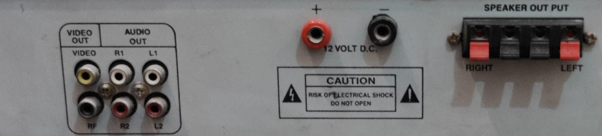
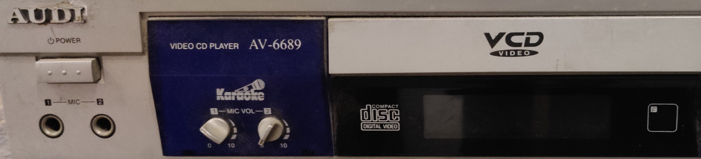
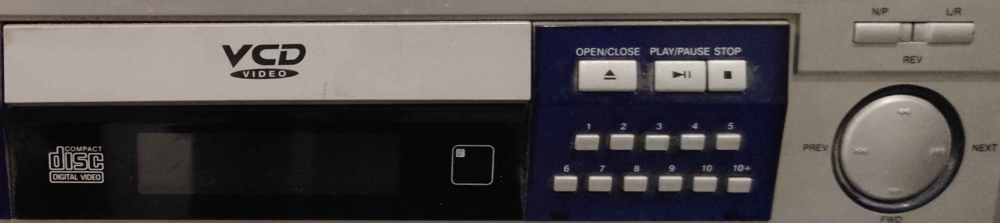

# Mind-AR Image Detection
## Augmented Reality annotations created using mind-ar library
* This repo allows you to annotate on desired hardware devices, provided we have a picture of our target image, to convert it to a .mind file.
* With multi-tracks we can even setup multiple image targets to be recognised and annotated simultaneously.
* Geometry component of aframe and PureBasic AR fonts (JSON format) are used to make the annotations.
* 3D models (preferable .glTF) can also be loaded if necessary, but kills the loading time.
* This website used an Audio Player for detection of ports and switches.

## Jump In

Scan the above QR code and follow the process to experience the live demo.

* Place the camera either in front of the actual object (hardware device) or the following image to view the annotations.

* Try changing the device's (AR supported phones) orientation or just placing a part of the object in front of the camera feed. All times the annotations will be placed correctly.
  
## What ifs?
  
When the image is too long (like the front of the audio player) and all of it can't come in the same camera feed for detection. The first and easy solution is, no need to worry, as long as there are enough features to recognise, the AR annotations will load up. The second, less preferable solution is, to split the image and use multi-tracks and position separately. However, in our case, as the features were sufficient, we go with solution one. Even if some part of the image target is placed in front of camera feed, the annotations easily loaded up. Try with the left part of audio player shown below:
  

  
One cool thing about the AR loaded up here is the Animated glTF model that uses animation-mixer component and gives a real effect of DVD opening and closing. However, it is just to demonstrate the power of AR and our main focus remains the annotation part. Now comes the common question, why not to split the image and create targets.mind. We shouldn't because firstly, the long image will still have enough features to load up AR with only, say 40% of it coming in the camera feed. Secondly, if the user places the part of object where you split from, we might not have enough features of either of the split parts, coming in the camera feed. So, unfortuneately in that case neither of the annotations will be able to load, as we have only, say 20% of the features of each of the split image targets. So, with the solution we are using, such cases won't arise.
  
Let's try the right part of the audio player.
  

  
As we haven't enabled multi-tracks, so simultaneus detection on more than one image target won't work here. Having the default multi-track value 1 improves the performance of the AR and we want that to happen.
  
##  Ways to Snapshot 📸
  
There are multiple approaches to take a snapshot once the AR annotations are loaded. Let's see all of them and we shall use the most efficient one.
  
* **Snapshot every time the image target is found:** This way works well for the first time but freezes from the next occurrence and onwards. The reason is your browser asking for permission to "download multiple images", which affects the load of AR annotations here.
* **Snapshot button:** This is the most optimized solution, it's least affected by the freeze due to multiple image downloads. The only thing is the button is non AR and it stays and occupies a part of your screen at all times.
* **Snapshot button but visibility hidden:** Here we only show the button when the image target is found. It's less optimized as it slows the process of loading AR content.
* **Snapshot glTF button:** Here a 3D model that loads along with the AR annotations does the job for you. It snapshots on click but it too shows a freezing effect.
* **Image target bind to snapshot button:** Here the snapshot button is clicked whenever image target is found. It's slightly better than finding the image target directly and taking snapshot but little less optimal than having the snapshot button at all times to take pictures.

  
## Wrapping up

The above setup works for the Audio Player I chose. The same code with a few adjuestments in entity's postion will allow it to work on any object (hardware device). Only changes to be made for accomplishing this are changing the target image and creating it's respective targets.mind file. Lastly, the smoothness value is set to high, it may cause a *lazy effect* on detection but this actually is helpful to prevent flickering of the annotations.
